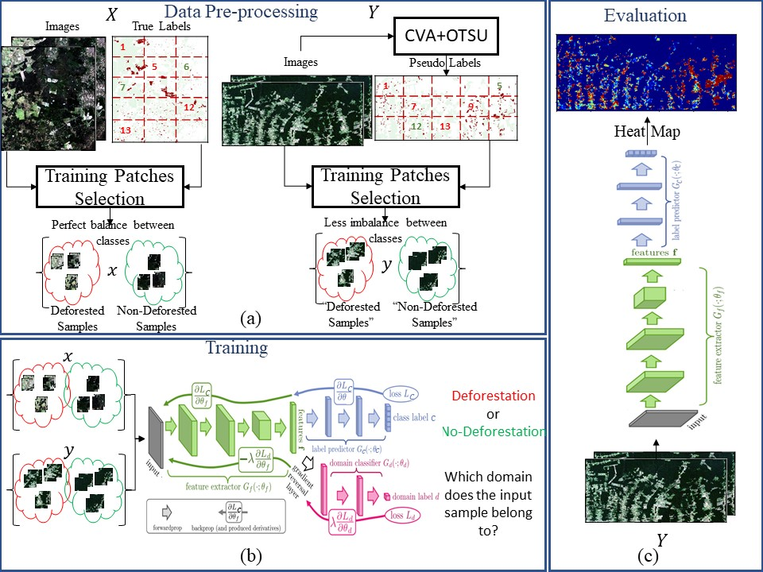

# DANN-Based-DA-for_CD-NOISY-LABELS
The current project conatins the code to perform Domain Adaptation based on Domain-Adversarial Neural Network (DANN) [1] for change detection in remote sensing images, specifically for deforestation detection in tropical forests such as the Amazon rainforest and the Brazilian savannah.

The following figure shows the proposed methodology. The domain adaptation process begins by selecting class-wise balanced training samples from both domains. A traditional down/up sampling strategy can be adopted for the source domain because the class labels are available. However, such balancing procedure can not be applied straightforwardly for the target domain due the target labels are unknown during training. To overcome that problem, we included a pseudo-labelling scheme based on Change Vector Analysis (CVA) and a thresholding technique based on the OTSU to produce a pseudo label map used to select a less imbalanced training set in target domains (a).

Then, the DANN model is trained with selected samples until convergence, as illustrated in (b). Once the model’s functions have been trained, Gf and Gc are used to classify the samples extracted from the target testing images (c).

# Prerequisites
1- Python 3.7.4

2- Tensorflow 1.14

# References

[1] Ganin and V. Lempitsky,“Unsupervised   domain   adaptation  by backpropagation,”arXiv preprint arXiv:1409.7495, 2014.
